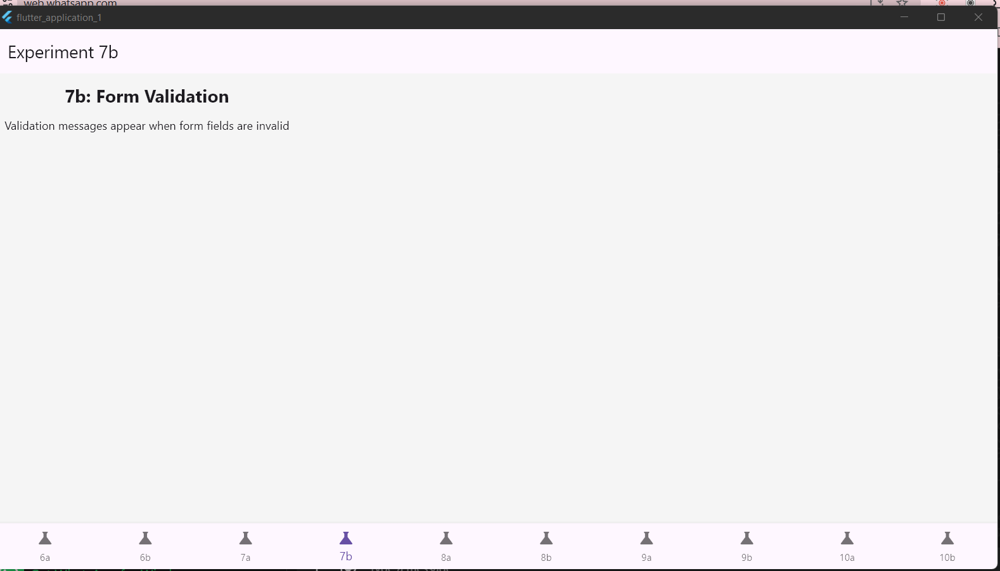

# flutter_application_1

A new Flutter project.

## Getting Started

This project is a starting point for a Flutter application.

A few resources to get you started if this is your first Flutter project:

- [Lab: Write your first Flutter app](https://docs.flutter.dev/get-started/codelab)
- [Cookbook: Useful Flutter samples](https://docs.flutter.dev/cookbook)

For help getting started with Flutter development, view the
[online documentation](https://docs.flutter.dev/), which offers tutorials,
samples, guidance on mobile development, and a full API reference.


# Flutter Experiments 6–10

This repository contains Flutter exercises 6–10, covering topics like **UI forms, validation, animations, API fetching, debugging tools, and testing**.  
Each experiment is designed to demonstrate **key Flutter concepts** in a practical way for learning and experimentation.

---

## 📄 Project Description

- **Goal**: Practice Flutter development with focused mini-projects.  
- **Topics Covered**:
  - Forms and form validation
  - Animation types and implementation
  - Fetching and displaying data from APIs
  - Debugging and testing widgets
  - UI enhancements and reusable custom widgets

- **Flutter Version**: Compatible with Flutter 3.x and above  
- **Platform Tested**: Windows Desktop, Web (Chrome & Edge)

---

## 🖼 Screenshots

> Replace these with your actual screenshots.

| Experiment | Screenshot |
|------------|------------|
| Ex6: Forms |  |
| Ex7: Form Validation |  |
| Ex8: Animations |  |
| Ex9: API & Display Data |  |
| Ex10: Debug & UI Tests |  |

---

## 🏃 Steps to Run

1. **Clone the repository**
```bash
git clone https://github.com/SatishPallyvela/experiments-6-10.git
cd experiments-6-10
